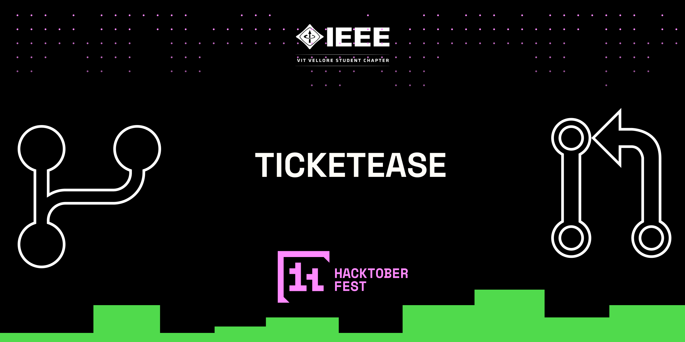

# Hacktoberfest, 2024 with IEEE-VIT Student Branch

Ticketease is a Node.js-powered web-based ticket booking platform that enables users to browse movies, select theaters, and make reservations seamlessly. This repository was created to help developers get started with Open Source during [Hacktoberfest](https://hacktoberfest.com/)
> NOTE: Check out `issues` labelled as `Hacktoberfest` and start contributing!

Made with ❤️ by [IEEE-VIT](https://ieeevit.com)

Support Open Source by participating in [Hacktoberfest](https://hacktoberfest.com/)💛

## Getting started

### Prerequisites
Ensure you have the following installed on your system:

- [Node.js](https://nodejs.org/en)
- [npm](https://www.npmjs.com/) (Node Package Manager)
- [MongoDB](https://www.mongodb.com/)
- [Git](https://git-scm.com/)

### Environment Setup
1. Create a `.env` file in the root of your project.
   
2. Add the required environment variables:
   ```env
   PORT=your_port_number
   DB=your_mongodb_connection_string
   GOOGLE_CLIENT_ID=your_google_client_id
   GOOGLE_CLIENT_SECRET=your_google_client_secret
   SESSION_SECRET=your_session_secret
   ```

   Replace the placeholder values with your actual credentials.
### Installation
1. Clone the repository to your local machine:
```bash
$ git clone https://github.com/IEEE-VIT/Ticket-Booking-Portal.git
```

2. Navigate into the backend directory:
```bash
$ cd backend
```

3. Create uploads directory:
```bash
$ mkdir uploads
```

4. To setup this project, simply run the following command:
```bash
$ npm install
```

It should create a `node_modules` folder, and you're good to go! :)

5. To start the project, simply run the following command:
```bash
$ npm run dev
```

### Project Structure
The project is organized into the following key directories and files:

- **routes/** - Contains the route definitions for the API endpoints.
  - `routes/User.js` - Routes for user-related operations.
  - `routes/Movie.js` - Routes for movie-related operations.
  - `routes/Theater.js` - Routes for theater-related operations.
  - `routes/Screen.js` - Routes for screen-related operations.
  - `routes/Booking.js` - Routes for booking-related operations.

- **controller/** - Contains the logic to handle the operations for each model.
  - `controller/User.js` - Handles user operations.
  - `controller/Movie.js` - Handles movie operations.
  - `controller/Theater.js` - Handles theater operations.
  - `controller/Screen.js` - Handles screen operations.
  - `controller/Booking.js` - Handles booking operations.

## Contributing
To start contributing, check out [CONTRIBUTING.md](https://github.com/KTKarthick006/Ticket-booking-website/blob/main/CONTRIBUTING.md). New contributors are always welcome to support this project. Check out issues labelled as `Hacktoberfest` if you are up for some grabs! :)

## License
This project is licensed under [MIT](https://github.com/IEEE-VIT/Ticket-Booking-Portal/blob/main/LICENSE)
